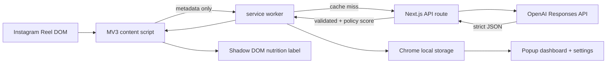

# DoomLess Digital Wellness AI

DoomLess is a privacy-first Digital Nutrition layer for Instagram Reels. It turns available caption and page metadata into an explainable 0–100 score, an attention-cost estimate, and a conscious choice: watch, save, limit, or skip.

## Why

Short-form feeds make popularity visible but hide attention cost. DoomLess makes the tradeoff legible without calling entertainment bad or shaming the viewer.

## Working MVP

- Manifest V3 Chrome extension for Instagram desktop
- Defensive Reel discovery with `MutationObserver` and active-Reel detection with `IntersectionObserver`
- Manual, 800 ms hover, and active-visible triggers; automatic analysis is off by default
- Caption, creator, hashtag, visible-text, accessibility-label, duration, and displayed-engagement extraction
- Server-only OpenAI Responses API integration with strict Zod structured output
- Deterministic 0–100 formula and risk-aware recommendation overrides
- Expandable, keyboard-accessible Shadow DOM overlay that does not inherit Instagram styles
- Chrome local cache, duplicate-request prevention, local history, actions, preferences, and compact daily dashboard
- Timeout, retry, invalid-response, cached fallback, and offline messaging
- Existing interactive web demo with curated short-form examples

## Architecture



See [architecture.md](docs/architecture.md) for source boundaries and data flow.

## Repository

```text
apps/extension/       Chrome MV3 extension
app/                  Hosted Next.js dashboard and API
packages/scoring/     Formula, recommendation, and relevance rules
packages/shared-types Strict request, response, preferences, and history types
docs/                 Architecture, privacy, limitations, demo, and test guidance
```

## Run locally

Requirements: Node.js 22+, pnpm, Chrome, and an OpenAI API key.

1. Copy `.env.example` to `.env.local` and add `OPENAI_API_KEY`.
2. Run `pnpm install`.
3. Run `pnpm dev` to start the API and web demo at `http://localhost:3000`.
4. Run `pnpm build:extension`.
5. Open `chrome://extensions`, enable Developer mode, choose **Load unpacked**, and select `apps/extension/dist`.
6. Open the extension settings, enable analysis, keep the backend URL as `http://localhost:3000`, then open Instagram Reels.

The extension requests only `storage` plus host access to Instagram, localhost, and the hosted demo domain. The OpenAI key never enters extension code.

## AI pipeline

1. Extract only data visibly available in the current Reel container.
2. Build a stable Reel ID from the `/reel/{id}` path or a SHA-256 metadata hash.
3. Return a cached analysis when present.
4. Validate the request, send available evidence and relevance preferences to GPT-5.6 Luna by default, and require strict JSON.
5. Validate the response again, recompute the transparent product score, and apply recommendation overrides.
6. Save the result and the user's action locally.

The formula is in `packages/scoring/src/index.ts`. Positive weights total 1.0; risk penalties total 0.25. The raw -25…100 range is shifted and normalized to 0…100.

## Commands

- `pnpm dev` — local API and web demo
- `pnpm build` — production Sites/Cloudflare build
- `pnpm build:extension` — unpacked Chrome extension bundle
- `pnpm typecheck` — web and extension TypeScript checks
- `pnpm test` — formula, schema, relevance, recommendation, identity, and cache tests
- `pnpm lint` — repository lint

## Live, permission-gated, demo, and future

| Capability | Status |
|---|---|
| Caption/creator/visible metadata analysis | Live, selector-defensive but Instagram-dependent |
| Automatic hover/visible analysis | Live only after the user enables it |
| Private Reel analysis | Automatic analysis blocked; explicit flow is intentionally conservative |
| Audio/transcript extraction | Only used if Instagram exposes text; no media scraping |
| Screenshot/frame analysis | Future permission-gated enhancement |
| Curated judge flow | Existing interactive web demo; clearly presented as demo content |

## Privacy and limitations

History and preferences stay in Chrome local storage. Supported Reel metadata is sent only after the user enables analysis or presses Analyze. Read [privacy.md](docs/privacy.md) and [limitations.md](docs/limitations.md).

## Demo

Use [demo-script.md](docs/demo-script.md) for the three-minute judging flow and [test-checklist.md](docs/test-checklist.md) for Instagram verification. Existing recording assets and screenshot guidance are documented in the demo script.

## Roadmap

1. Migrate the existing web demo cards to the new 0–100 shared contract and add six canonical demo fixtures.
2. Add a full weekly analytics route and saved-Reels library.
3. Add an explicit `activeTab` screenshot permission flow for optional multimodal analysis.
4. Add selector telemetry without collecting browsing content, and browser integration automation against a local Instagram fixture.
5. Add user-controlled replacement recommendations.

## Hackathon alignment

- **Technology:** MV3 lifecycle, live DOM detection, strict AI output, deterministic scoring, caching, privacy controls.
- **Design:** label-to-action flow, explainability, onboarding settings, compact behavioral dashboard, failure states.
- **Impact:** makes invisible attention costs visible and supports intentional consumption.
- **Idea quality:** separates intrinsic value, personal relevance, and behavioral risk.

## How Codex and GPT-5.6 were used

Codex audited and implemented the extension architecture, shared types, score policy, reliability controls, tests, and documentation. GPT-5.6 Luna is the default runtime analyst because this high-volume classification task benefits from the cost-sensitive GPT-5.6 tier. The server uses structured outputs and never delegates the published score formula to the model alone.
