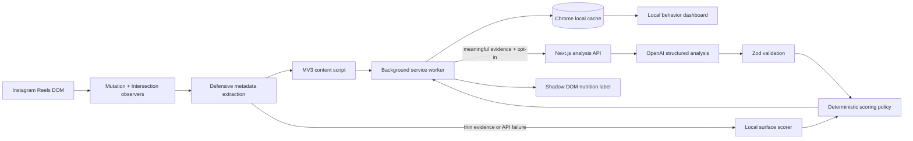

# DoomLess AI

**Digital Nutrition Labels for Instagram Reels.**

DoomLess AI is a privacy-first Chrome extension and interactive web beta that helps people decide whether a Reel deserves their attention. It turns the limited evidence available on Instagram into an explainable score, seven nutrition metrics, a plain-language verdict, and an honest confidence label.

[Live beta](https://doomless-ai-demo.poojavarshini1995.chatgpt.site/) · [Understand the score](https://doomless-ai-demo.poojavarshini1995.chatgpt.site/score-guide) · [Download Chrome beta v0.4.2](https://doomless-ai-demo.poojavarshini1995.chatgpt.site/doomless-ai-beta-v0.4.2.zip)

> Beta status: the extension works on Instagram desktop using selector-defensive DOM extraction. Instagram does not guarantee stable access to captions, transcripts, media files, or page structure, so DoomLess clearly distinguishes AI analysis, surface estimates, cached results, and demo data.

## Problem

Short-form feeds show popularity signals but hide attention cost. A viewer can see likes and comments, yet cannot quickly answer:

- Will this Reel teach me anything useful?
- Is it actionable or personally relevant?
- Is it efficient, repetitive, clickbait-heavy, or designed to keep me scrolling?
- Is it worthwhile entertainment, even when it is not educational?
- Should I watch, skim, save, or skip?

Most digital-wellbeing tools measure screen time after it has already been spent. DoomLess adds a decision layer before more attention is committed.

## Solution

DoomLess places a compact **Digital Nutrition Label** beside the active Reel. It extracts only the supported surface signals available in the browser, sends meaningful metadata to a server-side AI pipeline when enabled, validates the structured response, and recomputes the published score with deterministic TypeScript.

When Instagram exposes too little data or the API is unavailable, v0.4.2 produces a clearly labeled local surface estimate instead of an unexplained `--/100`. A zero-evidence public Reel receives a neutral 50/100 baseline, seven cautious metrics, and `0% evidence confidence`; this is explicitly not presented as full video analysis.

## Architecture



Repository layout:

```text
app/                    Hosted beta, score guide, and analysis API
apps/extension/         Chrome Manifest V3 extension
components/             Public beta and nutrition-label UI
packages/scoring/       Shared formula, score bands, policy, and explanations
packages/shared-types/  Zod schemas and TypeScript contracts
docs/                   Architecture, privacy, limitations, demo, and testing
public/                 Brand assets and current beta ZIP
scripts/                Build and beta packaging helpers
```

See [docs/architecture.md](docs/architecture.md) for lifecycle and trust-boundary details.

## Features

- Chrome Manifest V3 extension for Instagram desktop Reels.
- Active-Reel detection with `IntersectionObserver`.
- Dynamic Reel discovery with `MutationObserver`.
- Optional active-visible analysis, 800 ms hover analysis, and explicit analysis triggers.
- Defensive extraction of caption, creator, hashtags, visible text, accessibility labels, duration, and displayed engagement signals.
- Server-side OpenAI Responses API integration; API keys never enter the extension bundle.
- Strict Zod validation for inputs and structured model output.
- Deterministic 0-100 score shared by the extension and website.
- Seven explained metrics: Learning Value, Actionability, Personal Relevance, Time Efficiency, Emotional Impact, Clickbait Risk, and Addiction Risk.
- Risk metrics are explicitly marked: higher Clickbait and Addiction scores mean greater risk.
- Entertainment-aware conclusions that do not treat all non-educational content as bad.
- v0.4.2 local surface estimate when Instagram metadata or the live API is unavailable.
- Evidence note such as `Surface estimate · 40% evidence confidence` or `AI analysis · 85% evidence confidence`.
- Shadow DOM overlay with keyboard focus states and isolated styling.
- Stable Reel hashing, duplicate-request prevention, local caching, and history.
- Local preferences for interests, field, learning goals, avoided topics, daily Reel limit, and education/entertainment balance.
- Popup behavior dashboard with daily score, useful/skip counts, estimated attention saved, exposure signals, and recent decisions.
- Six interactive demo scenarios that use the same schema, scoring policy, overlay, and cache pipeline.
- Public score guide explaining every score band, category, weight, risk direction, and limited-analysis behavior.

## Digital Nutrition score

The shared formula lives in [packages/scoring/src/config.ts](packages/scoring/src/config.ts):

```text
Positive Value =
  Learning Value × 0.25
  + Actionability × 0.20
  + Personal Relevance × 0.20
  + Time Efficiency × 0.20
  + Emotional Impact × 0.15

Risk Penalty =
  Clickbait Risk × 0.10
  + Addiction Risk × 0.15

Overall Score = normalized Positive Value - Risk Penalty
```

The raw range is normalized to 0-100. The score is a transparent product heuristic, not a scientific, medical, or psychological measurement. Every category includes a short evidence-based interpretation.

| Score | Meaning | Default guidance |
|---:|---|---|
| 90-100 | Excellent Digital Value | Strongly recommended |
| 80-89 | High Digital Value | Worth watching |
| 70-79 | Good Digital Value | Worth watching |
| 60-69 | Mixed Digital Value | Watch selectively |
| 50-59 | Low Digital Value | Skim |
| 40-49 | Poor Digital Value | Probably skip |
| 20-39 | Digital Junk | Skip |
| 0-19 | Harmful Attention Pattern | Avoid |

Visit the live [Understanding Your DoomLess Score](https://doomless-ai-demo.poojavarshini1995.chatgpt.site/score-guide) page for category-level examples.

## Installation

### Install the beta extension

1. Download [DoomLess AI v0.4.2](https://doomless-ai-demo.poojavarshini1995.chatgpt.site/doomless-ai-beta-v0.4.2.zip).
2. Unzip it into a permanent folder.
3. Open `chrome://extensions` in Chrome.
4. Enable **Developer mode**.
5. Select **Load unpacked** and choose the unzipped folder containing `manifest.json`.
6. Pin DoomLess AI from Chrome's Extensions menu.
7. Open the extension settings and enable analysis.
8. Open or reload an Instagram Reel tab.

After updating the files, click **Reload** on the DoomLess card in `chrome://extensions`, then reload Instagram.

### Run locally

Requirements: Node.js 22+, pnpm, Chrome, and an OpenAI API key for live AI analysis.

```bash
cp .env.example .env.local
pnpm install
pnpm dev
```

Set these server-side variables in `.env.local`:

```env
OPENAI_API_KEY=your_key
OPENAI_MODEL=gpt-5.6-luna
```

Build the extension:

```bash
pnpm build:extension
```

Load `apps/extension/dist` through `chrome://extensions`. The packaged beta uses the hosted DoomLess endpoint by default; local developers can set the extension API base URL to `http://localhost:3000`.

## Demo instructions

### Fast judge flow without installing anything

1. Open the [live beta](https://doomless-ai-demo.poojavarshini1995.chatgpt.site/).
2. Choose one of the sample Reel scenarios.
3. Review the total score, seven category scores, risk direction, and one-line verdict.
4. Open the [score guide](https://doomless-ai-demo.poojavarshini1995.chatgpt.site/score-guide) to compare educational, entertainment, and promotional examples.

### Extension demo mode

1. Load the unpacked extension.
2. Open **Preferences, demo & privacy** from the popup.
3. Enable **Demo mode** and analysis.
4. Reload an Instagram Reel.
5. Expand the overlay to inspect all seven metrics.
6. Open the popup to show the local behavior dashboard.

Demo labels are explicitly marked and never claim to describe the real Reel underneath them. Use [docs/demo-script.md](docs/demo-script.md) for the three-minute presentation and [docs/test-checklist.md](docs/test-checklist.md) for the Instagram smoke test.

## AI pipeline

1. Detect only the active or intentionally hovered Reel.
2. Extract supported metadata from the best-scoring Reel container.
3. Create a stable Reel identifier from its path or a SHA-256 metadata hash.
4. Return a compatible cached result and suppress duplicate in-flight requests.
5. Validate metadata and local preferences with shared Zod schemas.
6. Send evidence to the configured OpenAI model from the backend only.
7. Require strict structured JSON rather than free-form prose.
8. Validate the model response again.
9. Recompute the score, score band, evidence level, attention-return estimate, and recommendation in deterministic TypeScript.
10. Save the analysis and supported interaction history locally.

If meaningful evidence is unavailable, the extension skips the AI request and uses the local surface scorer. If the API times out, fails, or returns invalid JSON, DoomLess checks the cache and then uses the same local fallback. Private Reel auto-analysis remains blocked.

## Privacy

- Analysis is opt-in and disabled by default.
- DoomLess targets supported Reel content only.
- It does not read passwords, private messages, or unrelated browsing data.
- API keys stay on the backend.
- Preferences, cache, history, and dashboard records stay in Chrome local storage by default.
- Private content is not automatically sent for analysis.
- Users can clear local history and cached data from settings.
- Surface estimates disclose when frames, audio, transcripts, pacing, or looping were not analyzed.

Read [docs/privacy.md](docs/privacy.md) for the full statement.

## Limitations

- Instagram DOM structure and selectors can change without notice.
- Caption, creator, duration, engagement, and accessibility metadata may be incomplete or absent.
- DoomLess does not scrape protected media files or promise transcript/audio access.
- v0.4.2 surface scores are intentionally cautious heuristics, not verified summaries of unseen video content.
- Attention saved and useful-seconds figures are transparent estimates, not scientific measurements.
- Personal relevance depends on locally selected preferences and visible topic signals.
- Demo mode is simulated and clearly labeled.
- Replacement-content retrieval and Chrome Web Store one-click installation are not included in this beta.

See [docs/limitations.md](docs/limitations.md) for the live, permission-gated, simulated, and future boundaries.

## Testing

The verified v0.4.2 release passes TypeScript checks, production extension and website builds, and 47 automated tests covering:

- scoring normalization and formula weights;
- risk penalties and recommendation overrides;
- schema validation;
- Reel hashing and cache behavior;
- preference matching;
- surface fallback and error sanitization;
- entertainment and promotional conclusions;
- seven-metric overlay rendering and brand links.

Useful commands:

```bash
pnpm typecheck
pnpm test
pnpm lint
pnpm build
pnpm build:extension
```

## Future roadmap

1. Chrome Web Store release and automatic extension updates.
2. User-triggered screenshot-assisted multimodal analysis.
3. Optional subtitle and transcript ingestion when a platform exposes them legitimately.
4. Saved useful-Reels library and richer weekly trends.
5. User-controlled better-content replacements.
6. Privacy-preserving selector health telemetry without browsing-content collection.
7. Support for additional short-form platforms after Instagram beta validation.

## Hackathon judging alignment

| Criterion | DoomLess evidence |
|---|---|
| Technological implementation | MV3 architecture, dynamic DOM detection, structured OpenAI output, deterministic scoring, schema validation, caching, local fallback, and production web/API build |
| Design | Complete Reel-to-label flow, polished overlay, score guide, preferences, dashboard, explainability, loading/error behavior, and interactive demo mode |
| Potential impact | Makes invisible attention costs visible, reduces low-value scrolling, and helps people intentionally choose educational or healthy entertainment content |
| Quality of idea | Introduces Digital Nutrition, separates intrinsic quality from personal relevance and behavioral risk, and turns digital wellbeing into an actionable decision layer |

## How Codex and GPT-5.6 were used

Codex acted as the implementation partner across repository inspection, extension architecture, scoring policy, React UI, reliability fixes, tests, documentation, build validation, and Sites deployment. The backend uses the configured GPT-5.6 model to transform supplied Reel evidence into a strict structured analysis. The model does not control the final published score directly: shared TypeScript policy validates and recomputes score bands, risk penalties, confidence behavior, and recommendations.

## License and beta feedback

This repository is a hackathon beta. Report issues through [GitHub Issues](https://github.com/poojavarshini/doomless-ai/issues/new), including the Instagram URL pattern, extension version, and whether the result was AI analysis, a surface estimate, cached, or demo-generated. Do not include private Reel content or account credentials.
