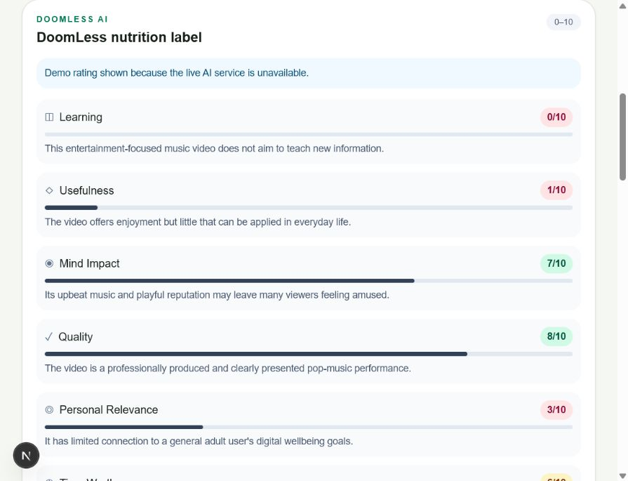

# DoomLess AI

A digital-wellbeing prototype that adds a clear "nutrition label" to short-form
videos. Users can submit a transcript or video URL and review seven scores:
Learning, Usefulness, Mind Impact, Quality, Personal Relevance, Time Worth, and
Scroll Risk.

## Live demo

### [Try DoomLess AI →](https://doomless-ai-demo.poojavarshini1995.chatgpt.site)

The public demo includes five Instagram Reel examples and five YouTube Shorts
examples. Select a demo video to see all seven nutrition-label scores and their
explanations—no installation or API key is required.

## Features

- Transcript and video-URL input modes
- Structured, validated scoring through the OpenAI Responses API
- Seven scores with one-sentence explanations
- Clear handling for API-key, quota, and model errors
- Five Instagram and five YouTube Shorts demo URLs with deterministic labels
- Production-safe labels for the ten curated demo videos
- Animated demo feed cards grouped by content category

## Architecture

- `app/page.tsx`: client-side input form, request state, result panel, and ten-video feed.
- `components/NutritionLabel.tsx`: reusable, typed score-card component.
- `app/api/analyze/route.ts`: validates requests and calls the OpenAI Responses API.
- `lib/scoring.ts`: Zod schemas and the neutral wellbeing scoring prompt.
- `lib/nutrition.ts`: shared frontend types and display metadata.
- `lib/demo-videos.ts`: the curated videos and deterministic demo labels.
- `lib/demo-labels.ts`: demo matching and local smoke-test fallback data.

The API key remains server-side and is never included in client code.

## Run locally

1. Install dependencies with `pnpm install`.
2. Create an ignored `.env.local` file containing `OPENAI_API_KEY=your_key`.
3. Optionally set `OPENAI_MODEL`; the default is `gpt-5.6-luna`.
4. Run `pnpm dev` and open `http://localhost:3000`.

## Prototype limitation

The route does not scrape or transcribe third-party video URLs. URL-only analysis
therefore produces a conservative label unless usable content is available to the
model. Transcript input is the reliable path for this scaffold.

## Security

Never commit `.env`, `.env.local`, or API credentials. Environment files are
ignored by Git, and the OpenAI API key is used only by the server-side route.
